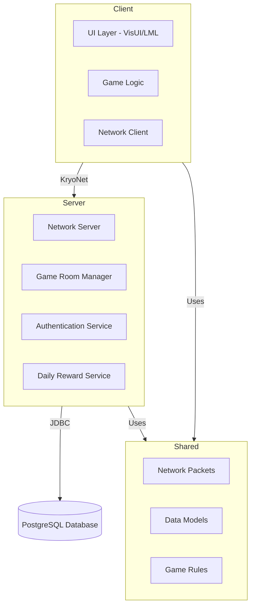

# Kế hoạch phát triển Royal FlushG - Game thẻ bài Poker & Tiến lên

## Tổng quan kiến trúc



## Giai đoạn 0: Chuẩn bị môi trường và Database Schema

### 0.1 Database Setup

**File**: Tạo script SQL `server/src/main/resources/database/schema.sql`

**Schema chi tiết**:

```sql
-- Bảng users
CREATE TABLE users (
    id SERIAL PRIMARY KEY,
    username VARCHAR(50) UNIQUE NOT NULL,
    password_hash VARCHAR(255) NOT NULL,
    credits BIGINT DEFAULT 1000 CHECK (credits >= 0),
    rank_points INT DEFAULT 0,
    current_rank VARCHAR(20) DEFAULT 'IRON',
    total_wins INT DEFAULT 0,
    total_losses INT DEFAULT 0,
    created_at TIMESTAMP DEFAULT CURRENT_TIMESTAMP,
    last_login TIMESTAMP,
    last_daily_reward TIMESTAMP
);

-- Bảng match_history
CREATE TABLE match_history (
    id SERIAL PRIMARY KEY,
    user_id INT REFERENCES users(id),
    game_type VARCHAR(20) NOT NULL, -- 'POKER' hoặc 'TIENLEN'
    match_mode VARCHAR(20) NOT NULL, -- 'MULTIPLAYER' hoặc 'SINGLEPLAYER'
    result VARCHAR(10) NOT NULL, -- 'WIN', 'LOSE', 'DRAW'
    credits_change BIGINT NOT NULL,
    opponent_count INT DEFAULT 1,
    duration_seconds INT,
    timestamp TIMESTAMP DEFAULT CURRENT_TIMESTAMP
);

-- Bảng game_rooms (cho multiplayer)
CREATE TABLE game_rooms (
    id SERIAL PRIMARY KEY,
    room_name VARCHAR(100),
    game_type VARCHAR(20) NOT NULL,
    host_user_id INT REFERENCES users(id),
    max_players INT DEFAULT 5,
    current_players INT DEFAULT 1,
    status VARCHAR(20) DEFAULT 'WAITING', -- 'WAITING', 'PLAYING', 'FINISHED'
    created_at TIMESTAMP DEFAULT CURRENT_TIMESTAMP,
    started_at TIMESTAMP
);

-- Bảng room_players (many-to-many)
CREATE TABLE room_players (
    room_id INT REFERENCES game_rooms(id),
    user_id INT REFERENCES users(id),
    position INT NOT NULL,
    joined_at TIMESTAMP DEFAULT CURRENT_TIMESTAMP,
    PRIMARY KEY (room_id, user_id)
);

-- Indexes
CREATE INDEX idx_users_username ON users(username);
CREATE INDEX idx_users_credits ON users(credits DESC);
CREATE INDEX idx_match_history_user_id ON match_history(user_id);
CREATE INDEX idx_match_history_timestamp ON match_history(timestamp DESC);
```

**Rank System** (tính toán trong code):

- IRON: 0 - 99,999 credits
- BRONZE: 100,000 - 499,999 credits
- SILVER: 500,000 - 999,999 credits
- GOLD: 1,000,000 - 2,999,999 credits
- PLATINUM: 3,000,000 - 4,999,999 credits
- DIAMOND: 5,000,000 - 9,999,999 credits
- MASTER: 10,000,000+ credits

### 0.2 Dependencies Update

**File**: `server/build.gradle`

- Thêm PostgreSQL driver: `org.postgresql:postgresql:42.7.2`
- Thêm BCrypt cho password hashing: `org.mindrot:jbcrypt:0.4`

**File**: `shared/build.gradle`

- Đảm bảo có KryoNet dependency

**File**: `core/build.gradle`

- Đảm bảo có đầy đủ VisUI, Autumn MVC, KryoNet

---

## Giai đoạn 1: Server Foundation & Database Layer

### 1.1 Database Manager

**File**: `server/src/main/java/com/mygame/server/database/DatabaseManager.java`

**Chức năng**:

- Connection pooling với HikariCP hoặc đơn giản với JDBC
- Method `initDatabase()`: Tạo tables nếu chưa có
- Method `getConnection()`: Lấy connection từ pool
- Method `close()`: Đóng tất cả connections

**File**: `server/src/main/java/com/mygame/server/database/UserDAO.java`

**Methods**:

- `register(String username, String password)`: Hash password bằng BCrypt, insert vào DB, trả về UserProfile
- `login(String username, String password)`: Verify password, update last_login, trả về UserProfile
- `updateCredits(int userId, long amount)`: Update credits và tính lại rank
- `getUserProfile(int userId)`: Lấy thông tin user
- `calculateRank(long credits)`: Tính rank dựa trên credits

**File**: `server/src/main/java/com/mygame/server/database/MatchHistoryDAO.java`

**Methods**:

- `saveMatch(int userId, String gameType, String matchMode, String result, long creditsChange, int opponentCount, int duration)`
- `getRecentMatches(int userId, int limit)`: Lấy lịch sử gần nhất

**File**: `server/src/main/java/com/mygame/server/database/LeaderboardDAO.java`

**Methods**:

- `getTopPlayers(int limit)`: Lấy top players theo credits
- `getPlayerRank(int userId)`: Lấy rank của player trong leaderboard

### 1.2 Server Launcher & Network Setup

**File**: `server/src/main/java/com/mygame/server/ServerLauncher.java`

**Chức năng**:

- Khởi tạo KryoNet Server (TCP port 54555, UDP port 54777)
- Register tất cả network packets từ shared module
- Khởi tạo DatabaseManager
- Tạo ServerListener để xử lý connections và packets
- Thread pool cho game rooms

**File**: `server/src/main/java/com/mygame/server/network/ServerListener.java`

**Xử lý**:

- `connected(Connection connection)`: Log connection
- `disconnected(Connection connection)`: Cleanup player data
- `received(Connection connection, Object object)`: Route packets đến handlers

**File**: `server/src/main/java/com/mygame/server/handlers/`

- `LoginHandler.java`: Xử lý LoginRequest, trả về LoginResponse
- `RegisterHandler.java`: Xử lý RegisterRequest
- `LeaderboardHandler.java`: Xử lý LeaderboardRequest
- `MatchHistoryHandler.java`: Xử lý MatchHistoryRequest

---

## Giai đoạn 2: Shared Module - Models & Network Packets

### 2.1 Enums & Constants

**File**: `shared/src/main/java/com/mygame/shared/model/Rank.java`

```java
public enum Rank {
    IRON, BRONZE, SILVER, GOLD, PLATINUM, DIAMOND, MASTER
}
```

**File**: `shared/src/main/java/com/mygame/shared/model/GameType.java`

```java
public enum GameType {
    POKER, TIENLEN
}
```

**File**: `shared/src/main/java/com/mygame/shared/model/MatchMode.java`

```java
public enum MatchMode {
    MULTIPLAYER, SINGLEPLAYER
}
```

### 2.2 Data Models

**File**: `shared/src/main/java/com/mygame/shared/model/PlayerProfile.java`

- Fields: id, username, credits, rank, totalWins, totalLosses
- Implement Kryo serializable

**File**: `shared/src/main/java/com/mygame/shared/model/LeaderboardEntry.java`

- Fields: rank, username, credits, rankEnum
- Implement Kryo serializable

**File**: `shared/src/main/java/com/mygame/shared/model/MatchHistoryEntry.java`

- Fields: gameType, matchMode, result, creditsChange, timestamp
- Implement Kryo serializable

### 2.3 Network Packets (KryoNet)

**File**: `shared/src/main/java/com/mygame/shared/network/packets/`

**Authentication Packets**:

- `LoginRequest.java`: username, password
- `LoginResponse.java`: success, playerProfile, errorMessage
- `RegisterRequest.java`: username, password
- `RegisterResponse.java`: success, playerProfile, errorMessage

**Lobby Packets**:

- `LeaderboardRequest.java`: limit
- `LeaderboardResponse.java`: List<LeaderboardEntry>
- `MatchHistoryRequest.java`: userId, limit
- `MatchHistoryResponse.java`: List<MatchHistoryEntry>
- `DailyRewardRequest.java`: userId
- `DailyRewardResponse.java`: success, creditsReceived, nextRewardTime

**Game Room Packets**:

- `CreateRoomRequest.java`: roomName, gameType, maxPlayers
- `CreateRoomResponse.java`: success, roomId, errorMessage
- `JoinRoomRequest.java`: roomId
- `JoinRoomResponse.java`: success, roomInfo, errorMessage
- `LeaveRoomRequest.java`: roomId
- `ListRoomsRequest.java`: gameType
- `ListRoomsResponse.java`: List<RoomInfo>
- `RoomUpdatePacket.java`: roomInfo (broadcast khi có thay đổi)

**Game Packets** (sẽ implement ở giai đoạn sau):

- `GameStartPacket.java`, `PlayerActionPacket.java`, `GameStatePacket.java`, etc.

**File**: `shared/src/main/java/com/mygame/shared/network/Network.java`

- Class chứa method `registerPackets()` để register tất cả packets với Kryo

---

## Giai đoạn 3: Client Network Service & Authentication UI

### 3.1 Network Service

**File**: `core/src/main/java/com/mygame/client/service/NetworkService.java`

**Chức năng**:

- Quản lý KryoNet Client connection
- Send/receive packets bất đồng bộ
- Event listeners cho connection status
- Queue packets nếu chưa connected
- Auto-reconnect logic

**Methods**:

- `connect(String host, int tcpPort, int udpPort)`
- `disconnect()`
- `sendPacket(Object packet)`
- `addListener(PacketListener listener)`
- `isConnected()`

**File**: `core/src/main/java/com/mygame/client/service/PacketListener.java`

- Interface với methods: `onLoginResponse()`, `onLeaderboardResponse()`, etc.

### 3.2 Session Manager

**File**: `core/src/main/java/com/mygame/client/service/SessionManager.java`

**Chức năng**:

- Lưu PlayerProfile hiện tại sau khi login
- Lưu connection state
- Singleton pattern

### 3.3 Login Screen

**File**: `assets/ui/templates/login.lml`

**Layout**:

- Background: `Background_screen.png`
- Container ở giữa màn hình với form đăng nhập
- 2 tabs: "Đăng nhập" và "Đăng ký"
- Input fields: Username, Password
- Button: "Đăng nhập" / "Đăng ký"
- Error message label (ẩn mặc định)

**File**: `core/src/main/java/com/mygame/client/controller/LoginController.java`

**Logic**:

- Inject NetworkService, SessionManager
- Handle input từ LML form
- Gửi LoginRequest/RegisterRequest
- Nhận response, lưu vào SessionManager
- Chuyển sang lobby nếu thành công
- Hiển thị error message nếu thất bại

---

## Giai đoạn 4: Main Lobby UI & Features

### 4.1 Lobby Screen Layout

**File**: `assets/ui/templates/lobby.lml`

**Layout chi tiết** (sử dụng VisTable):

```
┌─────────────────────────────────────────────────────────┐
│ [Settings]  User Hub: Avatar | Name | Rank | Credits   │
│                                                          │
│              ┌──────────┐  ┌──────────┐                │
│              │  POKER   │  │ TIẾN LÊN │                │
│              │  [IMG]   │  │  [IMG]   │                │
│              └──────────┘  └──────────┘                │
│                                                          │
│  ┌──────────────────────────────────────────────┐      │
│  │ LEADERBOARD                                  │      │
│  │ Rank | Name | Rank | Credits                 │      │
│  │  1   | ...  | ...  | ...                     │      │
│  │  2   | ...  | ...  | ...                     │      │
│  │  [Highlight own row]                         │      │
│  └──────────────────────────────────────────────┘      │
│                                                          │
│  Recent Matches: [5 matches]                            │
└─────────────────────────────────────────────────────────┘
```

**File**: `core/src/main/java/com/mygame/client/controller/LobbyController.java`

**Chức năng**:

- Load PlayerProfile từ SessionManager
- Gửi LeaderboardRequest và MatchHistoryRequest khi vào lobby
- Hiển thị user info ở top left
- Xử lý click vào POKER/TIẾN LÊN → hiện dialog chọn mode
- Render leaderboard table với highlight row của mình
- Render match history list

**Dialog chọn chế độ chơi**:

- File: `assets/ui/templates/dialogs/game_mode_selection.lml`
- 2 buttons: "Multiplayer" và "Singleplayer"
- Controller: `GameModeSelectionDialog.java`

### 4.2 Settings Dialog

**File**: `assets/ui/templates/dialogs/settings.lml` (có thể mở rộng từ file hiện có)

**Thêm**:

- Slider điều chỉnh Music Volume
- Slider điều chỉnh Sound Volume
- Button "Out Game" (thoát về login)

**File**: `core/src/main/java/com/mygame/client/controller/dialog/SettingsController.java` (mở rộng)

**Logic**:

- Load preferences hiện tại
- Save khi thay đổi
- Apply ngay lập tức cho music/sound

---

## Giai đoạn 5: Daily Reward System

### 5.1 Server Side

**File**: `server/src/main/java/com/mygame/server/database/DailyRewardDAO.java`

**Methods**:

- `canClaimDailyReward(int userId)`: Kiểm tra last_daily_reward
- `claimDailyReward(int userId)`: Update last_daily_reward, add credits (1000-5000 random)
- `getNextRewardTime(int userId)`: Tính thời gian có thể nhận tiếp theo

**File**: `server/src/main/java/com/mygame/server/handlers/DailyRewardHandler.java`

**Logic**:

- Nhận DailyRewardRequest
- Kiểm tra có thể claim không (24h từ lần cuối)
- Nếu được: add credits, update timestamp
- Trả về DailyRewardResponse

### 5.2 Client Side

**File**: `core/src/main/java/com/mygame/client/controller/DailyRewardController.java`

**Chức năng**:

- Kiểm tra daily reward khi vào lobby
- Hiện popup nếu có thể nhận
- Gửi DailyRewardRequest
- Hiển thị animation nhận reward

**File**: `assets/ui/templates/dialogs/daily_reward.lml`

**UI**:

- Popup đẹp với animation
- Hiển thị số credits nhận được
- Button "Nhận thưởng"
- Countdown timer đến lần nhận tiếp theo

---

## Giai đoạn 6: Game Room System (Multiplayer)

### 6.1 Server Room Manager

**File**: `server/src/main/java/com/mygame/server/room/GameRoomManager.java`

**Chức năng**:

- Quản lý tất cả game rooms
- Tạo room mới
- Thêm/xóa players
- Broadcast room updates
- Cleanup rooms khi empty

**File**: `server/src/main/java/com/mygame/server/room/GameRoom.java`

**Fields**:

- roomId, roomName, gameType, hostUserId
- List<RoomPlayer>, maxPlayers, status
- Methods: addPlayer(), removePlayer(), canStart(), start()

### 6.2 Room UI

**File**: `assets/ui/templates/room_lobby.lml`

**Layout**:

- Danh sách players trong room (5 slots)
- Button "Bắt đầu" (chỉ host thấy)
- Button "Rời phòng"
- Chat box (optional)

**File**: `core/src/main/java/com/mygame/client/controller/RoomLobbyController.java`

**Logic**:

- Gửi CreateRoomRequest hoặc JoinRoomRequest
- Nhận RoomUpdatePacket để update UI
- Xử lý LeaveRoomRequest
- Khi host bấm "Bắt đầu" → gửi StartGameRequest

### 6.3 Room List UI

**File**: `assets/ui/templates/room_list.lml`

**Layout**:

- Table hiển thị danh sách rooms
- Cột: Room Name, Game Type, Players/Max, Host, Button "Tham gia"
- Button "Tạo phòng mới"
- Button "Làm mới"

**File**: `core/src/main/java/com/mygame/client/controller/RoomListController.java`

**Logic**:

- Gửi ListRoomsRequest khi vào màn hình
- Render table với rooms
- Xử lý join room

---

## Giai đoạn 7: Poker Game Logic & UI

### 7.1 Shared Game Logic

**File**: `shared/src/main/java/com/mygame/shared/game/card/Card.java`

- Suit (CLUBS, DIAMONDS, HEARTS, SPADES), Rank (2-14, 14=Ace)

**File**: `shared/src/main/java/com/mygame/shared/game/card/Deck.java`

- 52 cards, shuffle(), deal()

**File**: `shared/src/main/java/com/mygame/shared/game/poker/PokerHand.java`

- Evaluate hand: High Card, Pair, Two Pair, Three of a Kind, Straight, Flush, Full House, Four of a Kind, Straight Flush, Royal Flush
- Compare hands

**File**: `shared/src/main/java/com/mygame/shared/game/poker/PokerGameState.java`

- Game state: PREFLOP, FLOP, TURN, RIVER, SHOWDOWN
- Pot, currentBet, activePlayers, communityCards, playerHoles

### 7.2 Poker UI Layout

**File**: `assets/ui/templates/poker_game.lml`

**Layout chi tiết** (theo yêu cầu):

```
┌─────────────────────────────────────────────────────────┐
│ [Menu]                              [Opponent 1 Hub]   │
│                                                          │
│  [Deck]         [Community Cards: 5 cards]             │
│                 [Pot: XXX credits]                      │
│                                                          │
│  [Opponent 2]                    [Opponent 3]           │
│  Hub                            Hub                     │
│                                                          │
│  ┌──────────────────────────────────────────────┐     │
│  │ [Fold] [Check] [Call] [Raise] [All-in]        │     │
│  │ [Bet Slider]                                   │     │
│  └──────────────────────────────────────────────┘     │
│                                                          │
│  [Opponent 4 Hub]        [Player: 2 Hole Cards]        │
│                          (1/3 màn hình)                │
└─────────────────────────────────────────────────────────┘
```

**File**: `core/src/main/java/com/mygame/client/controller/PokerGameController.java`

**Chức năng**:

- Render 2 hole cards của player ở góc phải dưới (1/3 màn hình)
- Render 5 community cards ở giữa (lật dần theo vòng)
- Render 4 opponents ở các cạnh với hub (avatar, name, credit, status)
- Render deck ở góc trái giữa
- Render control buttons ở góc trái/giữa dưới (2/3 màn hình)
- Chỉ hiện buttons khi đến lượt player
- Animation chia bài từ deck đến player và community

**Animation**:

- File: `core/src/main/java/com/mygame/client/animation/CardDealAnimation.java`
- Sử dụng Scene2D Actions: MoveTo, ScaleTo, RotateTo
- Card bay từ deck position đến target position

### 7.3 Poker Game Flow

**File**: `core/src/main/java/com/mygame/client/game/PokerGameManager.java`

**Logic**:

- Quản lý game state
- Xử lý player actions (fold, check, call, raise, all-in)
- Validate bets
- Tính toán pot
- Xử lý showdown
- Update credits sau mỗi hand

**Network**:

- Gửi PlayerActionPacket khi player hành động
- Nhận GameStatePacket để sync state

---

## Giai đoạn 8: Tiến Lên Game Logic & UI

### 8.1 Shared Tiến Lên Logic

**File**: `shared/src/main/java/com/mygame/shared/game/tienlen/TienLenCard.java`

- Card với rank (3-2, A, K, Q, J) và suit
- So sánh theo luật Tiến lên (heo > A > K > ... > 3)

**File**: `shared/src/main/java/com/mygame/shared/game/tienlen/CardCollection.java`

**Chức năng**:

- Validate combinations: Đơn, Đôi, Tam, Tứ quý, Sảnh (3+ cards)
- So sánh combinations (đôi đè đôi, tứ quý chặt heo, etc.)
- Chặt heo logic

**File**: `shared/src/main/java/com/mygame/shared/game/tienlen/TienLenGameState.java`

- Current player turn
- Last played cards (để chặt)
- Player hands
- Game status

### 8.2 Tiến Lên UI Layout

**File**: `assets/ui/templates/tienlen_game.lml`

**Layout** (khác biệt với Poker):

```
┌─────────────────────────────────────────────────────────┐
│ [Menu]                                                   │
│                                                          │
│  [Opponent Left]                                        │
│  Hub + Cards                                             │
│                                                          │
│  [Opponent Top]        [Center: Played Cards]           │
│  Hub + Cards                                             │
│                                                          │
│  [Opponent Right]                                       │
│  Hub + Cards                                             │
│                                                          │
│  [Player Cards: Arc Layout]                             │
│  (Bottom Center)                                         │
│                                                          │
│              [Đánh] [Bỏ lượt] [Xếp bài]                 │
│              (Bottom Right)                              │
└─────────────────────────────────────────────────────────┘
```

**File**: `core/src/main/java/com/mygame/client/controller/TienLenGameController.java`

**Chức năng**:

- Render player cards ở bottom center dạng arc (quạt)
- Hover effect: card nảy lên
- Click để select/deselect cards
- Render 3 opponents ở 3 cạnh (left, top, right)
- Render played cards ở center
- Control buttons ở bottom right
- Animation đánh bài

**Card Selection**:

- File: `core/src/main/java/com/mygame/client/ui/CardActor.java`
- Extend ImageButton
- Hover animation (MoveBy + ScaleTo)
- Selection state

### 8.3 Tiến Lên Game Flow

**File**: `core/src/main/java/com/mygame/client/game/TienLenGameManager.java`

**Logic**:

- Validate selected cards combination
- So sánh với last played cards
- Xử lý chặt heo
- Check win condition (hết bài)
- Update turn

---

## Giai đoạn 9: Singleplayer Bot AI

### 9.1 Poker Bot

**File**: `core/src/main/java/com/mygame/client/ai/PokerBot.java`

**AI Strategy** (đơn giản):

- Tính xác suất thắng dựa trên hole cards và community cards
- Fold nếu xác suất < 30%
- Check/Call nếu xác suất 30-60%
- Raise nếu xác suất > 60%
- All-in nếu có strong hand (Straight Flush, Four of a Kind)

### 9.2 Tiến Lên Bot

**File**: `core/src/main/java/com/mygame/client/ai/TienLenBot.java`

**AI Strategy** (theo yêu cầu):

- Luôn đánh lá nhỏ nhất có thể chặt được bài trên bàn
- Nếu không chặt được → bỏ lượt
- Ưu tiên đánh đơn, đôi, tam trước
- Giữ heo và tứ quý để chặt

**File**: `core/src/main/java/com/mygame/client/ai/TienLenBotStrategy.java`

- Logic tìm combination nhỏ nhất có thể chặt

---

## Giai đoạn 10: Game State Synchronization & Network

### 10.1 Game Packets (Shared)

**File**: `shared/src/main/java/com/mygame/shared/network/packets/game/`

- `GameStartPacket.java`: Thông tin khi bắt đầu game
- `PlayerActionPacket.java`: Action của player (fold, bet, etc.)
- `GameStatePacket.java`: Full game state để sync
- `PlayerTurnPacket.java`: Thông báo đến lượt ai
- `GameEndPacket.java`: Kết quả game, credits change

### 10.2 Server Game Handler

**File**: `server/src/main/java/com/mygame/server/game/GameSession.java`

**Chức năng**:

- Quản lý game state cho một room
- Validate player actions
- Broadcast state updates
- Tính toán kết quả
- Lưu match history

**File**: `server/src/main/java/com/mygame/server/game/PokerGameSession.java`

**File**: `server/src/main/java/com/mygame/server/game/TienLenGameSession.java`

### 10.3 Client Game Network Handler

**File**: `core/src/main/java/com/mygame/client/game/GameNetworkHandler.java`

**Chức năng**:

- Nhận GameStatePacket và update UI
- Nhận PlayerTurnPacket và highlight current player
- Nhận GameEndPacket và hiển thị kết quả

---

## Giai đoạn 11: Polish & Additional Features

### 11.1 Sound Effects

**File**: `core/src/main/java/com/mygame/client/service/SoundService.java`

- Load sound effects: card flip, chip sound, win/lose sound
- Play với volume từ preferences

### 11.2 Animations

- Card flip animation
- Chip stack animation
- Win/lose screen animation
- Transition animations giữa các màn hình

### 11.3 Error Handling

- Network timeout handling
- Reconnection logic
- Error messages user-friendly

### 11.4 Performance Optimization

- Texture atlas cho cards
- Object pooling cho card actors
- Efficient rendering

---

## Thứ tự thực hiện đề xuất

1. **Giai đoạn 0-1**: Database + Server foundation (1-2 ngày)
2. **Giai đoạn 2**: Shared models & packets (1 ngày)
3. **Giai đoạn 3**: Login UI (1 ngày)
4. **Giai đoạn 4**: Lobby UI (2 ngày)
5. **Giai đoạn 5**: Daily rewards (1 ngày)
6. **Giai đoạn 6**: Room system (2-3 ngày)
7. **Giai đoạn 7**: Poker game (3-4 ngày)
8. **Giai đoạn 8**: Tiến lên game (3-4 ngày)
9. **Giai đoạn 9**: Bot AI (2 ngày)
10. **Giai đoạn 10**: Network sync (2-3 ngày)
11. **Giai đoạn 11**: Polish (2-3 ngày)

**Tổng thời gian ước tính**: 20-25 ngày làm việc

---

## Lưu ý kỹ thuật

1. **Kryo Serialization**: Tất cả packets và models phải implement `KryoSerializable` hoặc có default constructor
2. **Thread Safety**: Server handlers phải thread-safe
3. **Database Transactions**: Sử dụng transactions cho operations quan trọng (update credits, save match)
4. **UI Responsiveness**: Sử dụng AsyncTask hoặc thread pool cho network calls
5. **Asset Management**: Preload assets trước khi vào game screen
6. **Memory Management**: Dispose textures và actors khi không dùng
7. **Error Logging**: Sử dụng logging framework (SLF4J + Logback)