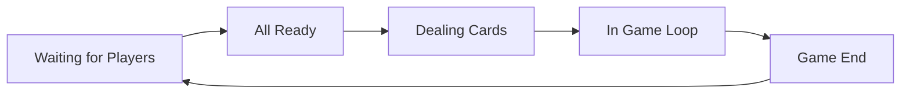

# BÁO CÁO DỰ ÁN PHÁT TRIỂN PHẦN MỀM
# ROYAL FLUSH (VERSION 1.0.0)

**Dự án:** Game Bài Đổi Thưởng / Giải Trí (Tien Len Mien Nam)
**Nền tảng:** Cross-platform (Desktop/Android)
**Ngày lập:** 16/01/2026
**Người lập:** Senior IT Project Manager (AI Assistant)

---

## MỤC LỤC

1.  **CHƯƠNG 1: TỔNG QUAN DỰ ÁN**
    1.1. Bối cảnh và Nhu cầu
    1.2. Mục tiêu Dự án
    1.3. Phạm vi Dự án (Scope)
    1.4. Đối tượng Người dùng

2.  **CHƯƠNG 2: NỀN TẢNG CÔNG NGHỆ VÀ CÔNG CỤ**
    2.1. Ngôn ngữ Lập trình & Môi trường
    2.2. Frameworks & Libraries
    2.3. Kiến trúc Phần mềm (Architectural Patterns)
    2.4. Hệ thống Build & Quản lý Phụ thuộc

3.  **(NỘI DUNG ĐƯỢC LƯỢC BỎ THEO YÊU CẦU)**

4.  **CHƯƠNG 4: THIẾT KẾ HỆ THỐNG (SYSTEM DESIGN)**
    4.1. Kiến trúc Tổng thể (High-Level Architecture)
    4.2. Thiết kế Cơ sở Dữ liệu & Shared State
    4.3. Giao thức Mạng (Network Protocol)
    4.4. Luồng Dữ liệu (Data Flow)

5.  **CHƯƠNG 5: HIỆN THỰC CHI TIẾT (IMPLEMENTATION)**
    5.1. Cấu trúc Module (Multi-module Gradle)
    5.2. Client-Side Implementation (Core)
    5.3. Server-Side Implementation
    5.4. Logíc Game Tiến Lên (Game Mechanics)

6.  **CHƯƠNG 6: QUẢN LÝ DỰ ÁN VÀ RỦI RO**
    6.1. Tiến độ và Lộ trình (Roadmap)
    6.2. Phân tích Rủi ro (Risk Analysis)
    6.3. Chiến lược Kiểm thử (Testing Strategy)

7.  **CHƯƠNG 7: KẾT LUẬN VÀ KIẾN NGHỊ**

---

## CHƯƠNG 1: TỔNG QUAN DỰ ÁN

### 1.1. Bối cảnh và Nhu cầu
Thị trường game bài trực tuyến (Online Card Games) tại Việt Nam và khu vực Châu Á luôn có sức hút lớn mạnh. Nhu cầu về một nền tảng giải trí đa nền tảng, hoạt động mượt mà trên cả Desktop và Mobile, với độ trễ thấp (low latency) là rất cấp thiết. Dự án **Royal Flush** được khởi động nhằm đáp ứng nhu cầu này, tập trung vào trải nghiệm người dùng cao cấp (Premium UX) và sự ổn định của hệ thống mạng.

### 1.2. Mục tiêu Dự án
Mục tiêu cốt lõi của dự án là xây dựng một hệ thống game bài hoàn chỉnh với game chủ đạo là **Tiến Lên Miền Nam**, có khả năng mở rộng sang các thể loại khác (Poker, Phỏm) trong tương lai.
Các KPI kỹ thuật chính bao gồm:
*   **Hiệu năng:** Đạt 60 FPS ổn định trên các thiết bị tầm trung.
*   **Mạng:** Xử lý realtime multiplayer với độ trễ < 100ms.
*   **Kiến trúc:** Clean Architecture, dễ bảo trì và mở rộng (Scalable).

### 1.3. Phạm vi Dự án (Scope)
*   **Client:** Ứng dụng Desktop (LWJGL3) và Android (LibGDX).
*   **Server:** Game Server độc lập xử lý logic ván bài, matchmaking và chat.
*   **Game Logic:** Luật chơi Tiến Lên Miền Nam chuẩn, xử lý luật chặt heo, thối 3 bích, tới trắng.
*   **UI/UX:** Giao diện hiện đại, sử dụng LML (LibGDX Markup Language) để tách biệt logic hiển thị.

### 1.4. Đối tượng Người dùng
*   Người chơi giải trí (Casual gamers).
*   Nhóm người chơi yêu thích tính cạnh tranh (Competitive players) thông qua hệ thống Ranking/Leaderboard.

---

## CHƯƠNG 2: NỀN TẢNG CÔNG NGHỆ VÀ CÔNG CỤ

### 2.1. Ngôn ngữ Lập trình & Môi trường
*   **Java 17:** Ngôn ngữ chính cho toàn bộ dự án. Java 17 mang lại hiệu năng cao, garbage collection tối ưu (ZGC/G1GC) và các tính năng hiện đại (Records, Switch expressions) giúp code gọn gàng hơn, đặc biệt hữu ích cho việc định nghĩa các Packet mạng.
*   **Gradle 8.14.3:** Hệ thống build automation mạnh mẽ, quản lý multi-project dependencies một cách chặt chẽ.

### 2.2. Frameworks & Libraries

#### 2.2.1. LibGDX (v1.14.0)
Được chọn làm Core Engine nhờ khả năng cross-platform tuyệt vời. LibGDX cho phép viết code logic một lần và deploy lên Desktop (Windows/Linux/Mac), Android, iOS và Web (HTML5).
*   **Modules:** `gdx`, `gdx-box2d` (physics - tiềm năng cho hiệu ứng bài), `gdx-freetype` (font rendering sắc nét).

#### 2.2.2. Autumn MVC (v1.10.1.12.1)
Đây là "trái tim" của kiến trúc Client. Thay vì code UI thủ công ("spaghetti code"), dự án sử dụng Autumn MVC để áp dụng Dependency Injection (DI) và mô hình MVC (Model-View-Controller).
*   **Lợi ích:** Tự động quản lý vòng đời (lifecycle) của các màn hình (Screen), tự động load Assets (`@Asset`), và phân tách rõ ràng giữa giao diện (LML) và logic điều khiển (Controller).

#### 2.2.3. KryoNet (v2.22.7)
Thư viện Networking chuyên dụng cho Game Java.
*   **Đặc điểm:** Sử dụng **Kryo serialization** (binary format) cực nhanh và nhỏ gọn, tối ưu hơn nhiều so với JSON/XML.
*   **Giao thức:** Hỗ trợ cả TCP (cho các thao tác quan trọng như login, turn) và UDP (cho các thao tác cần tốc độ cao như position sync, dù game bài chủ yếu dùng TCP).

### 2.3. Kiến trúc Phần mềm (Architectural Patterns)
*   **MVC (Client):** Tách biệt Model (Data), View (LML Templates), Controller (Java handling).
*   **Client-Server Authoritative:** Server nắm giữ "Source of Truth" (trạng thái game chuẩn), Client chỉ gửi Actions và hiển thị State trả về. Điều này ngăn chặn hack/cheat.

---

## CHƯƠNG 4: THIẾT KẾ HỆ THỐNG (SYSTEM DESIGN)

### 4.1. Kiến trúc Tổng thể (High-Level Architecture)
Hệ thống được chia thành 4 phân hệ chính (Modules):

1.  **Shared Module (`:shared`):**
    *   Chứa các POJO (Plain Old Java Objects) được dùng chung.
    *   **Network Packets:** Định nghĩa các class Request/Response (ví dụ: `LoginRequest`, `CardPlayRequest`).
    *   **Game Models:** `TienLenGameState`, `Card`, `PlayerProfile`.
    *   *Mục đích:* Đảm bảo tính nhất quán dữ liệu giữa Client và Server khi serialize bằng Kryo.

2.  **Server Module (`:server`):**
    *   Headless Application (không UI).
    *   **Services:** `AuthenticationService`, `RoomManager`, `GameLoop`.
    *   **Logic:** Xử lý validate bài (`CardCollection.isValidMove`), tính điểm, chia bài.

3.  **Core Client Module (`:core`):**
    *   Chứa logic hiển thị và tương tác người dùng.
    *   Sử dụng `Screen` pattern của LibGDX kết hợp `View` của Autumn MVC.
    *   **Services:** `NetworkService` (gửi nhận packet), `AudioService`.

4.  **Platform Launchers (`:lwjgl3`, `:android`):**
    *   Các module wrapper để khởi chạy ứng dụng trên từng nền tảng cụ thể.

### 4.2. Thiết kế Cơ sở Dữ liệu & Shared State
Trạng thái game (Game State) là thành phần quan trọng nhất, được định nghĩa trong class `TienLenGameState`.

| Thuộc tính | Kiểu dữ liệu | Mô tả |
| :--- | :--- | :--- |
| `playerHands` | `Map<Integer, List<Card>>` | Bài trên tay của từng người chơi. Server biết hết, Client chỉ biết của mình. |
| `currentTrick` | `List<Card>` | Tập hợp các lá bài vừa được đánh ra trên bàn. |
| `playerOrder` | `List<Integer>` | Danh sách ID người chơi theo thứ tự vòng đánh (ngược chiều kim đồng hồ). |
| `currentPlayerTurn`| `int` | Index của người đang có lượt trong `playerOrder`. |
| `skippedPlayers` | `Set<Integer>` | Danh sách người chơi đã "Bỏ lượt" trong vòng này. |
| `winners` | `List<Integer>` | Danh sách người chơi đã thắng (về Nhất, Nhì...) để xếp hạng. |

**Biểu đồ trạng thái (Game Flow State Machine):**


### 4.3. Giao thức Mạng (Network Protocol)
Hệ thống sử dụng các Packet được đăng ký trước (Pre-registered) trong class `Network.java`. Việc đăng ký thứ tự class phải **giống hệt nhau** giữa Client và Server để Kryo hoạt động đúng.

**Quy trình Đăng nhập & Vào bàn:**
1.  Client gửi `LoginRequest(user, pass)`.
2.  Server xác thực DB, trả về `LoginResponse(token, userInfo)`.
3.  Client gửi `ListRoomsRequest`.
4.  Client chọn bàn, gửi `JoinRoomRequest(roomId)`.
5.  Server gửi `RoomUpdatePacket` cho tất cả người chơi trong phòng (báo có người mới vào).

**Quy trình Đánh bài (Gameplay):**
1.  Server gửi `PlayerTurnPacket(playerId)` -> Client hiển thị lượt.
2.  Client chọn bài, gửi `PlayerActionPacket(cards)`.
3.  Server validate:
    *   Có phải lượt người đó không?
    *   Bộ bài có trong tay không?
    *   Bộ bài có hợp lệ (đúng luật Tiến Lên) không?
    *   Có chặt được bài trên bàn không?
4.  Nếu Valid: Server update `GameState`, gửi `GameStatePacket` broadcast cho tất cả.
5.  Nếu Invalid: Server gửi `ErrorPacket` riêng cho Client đó.

---

## CHƯƠNG 5: HIỆN THỰC CHI TIẾT (IMPLEMENTATION)

### 5.1. Module hóa & Build config (`build.gradle`)
Dự án sử dụng file `build.gradle` gốc để định nghĩa `allprojects` và `subprojects`.
*   **Asset Management:** Task `generateAssetList` được viết custom bằng Groovy để tự động tạo file `assets.txt` duyệt toàn bộ thư mục `assets/`. Điều này giúp `AssetManager` preload toàn bộ tài nguyên mà không cần hardcode từng file.
*   **Version Control:** Các thư viện như `gdxVersion`, `visUiVersion` được quản lý tập trung trong `gradle.properties`, giúp việc nâng cấp dễ dàng.

### 5.2. Client-Side Implementation (Core)

#### 5.2.1. Views & Controllers (Autumn MVC)
*   **MenuController:** `@View(id = "menu", value = "ui/templates/menu.lml")`. Quản lý logic menu chính. Các nút bấm trong file LML gọi trực tiếp xuống controller thông qua cơ chế reflection của LML (ví dụ: `onChange="show:game"`).
*   **GameController:** Quản lý màn hình chơi chính. Inject `NetworkService` để lắng nghe sự kiện từ Server.

#### 5.2.2. UI Components & LML
Sử dụng LML (XML) giúp tách code Java khỏi định nghĩa Layout.
Ví dụ một nút bấm trong LML:
```xml
<textButton id="btnPlay" onChange="joinRoom" style="default" pad="10">VÀO CHƠI</textButton>
```
Code này sẽ tự động map sự kiện click vào hàm `joinRoom()` trong Controller.

#### 5.2.3. Game Entities (`CardActor`)
Class `CardActor` kế thừa từ LibGDX `Actor`, đại diện cho một lá bài trên màn hình.
*   **Animation:** Sử dụng `Actions` (moveTo, scaleTo, rotateBy) để tạo hiệu ứng chia bài và đánh bài mượt mà.
*   **Interaction:** Xử lý `InputListener` cho sự kiện Drag & Drop (kéo thả bài) hoặc Click (chọn bài).

### 5.3. Xử lý Logic Game (Shared/Server)
Logic Tiến Lên (Tien Len Logic) được đặt trong module `shared` để Server validate và Client (nếu cần) predict (dự đoán).
*   **Phát hiện bộ bài (Combo Detection):**
    Thuật toán trong `CardCollection` phân tích `List<Card>` để xác định loại:
    *   Rác (Single)
    *   Đôi (Pair)
    *   Sám cô (Three of a kind)
    *   Sảnh (Straight) - kiểm tra tính liên tiếp của Rank.
    *   Đôi thông, Tứ quý (Bombs).
*   **Luật Chặt (Validation):**
    So sánh `currentTrick` và `newCards` dựa trên `Rank` và `Suit`. Xử lý trường hợp đặc biệt: 3 đôi thông chặt heo, tứ quý chặt 3 đôi thông/heo.

---

## CHƯƠNG 6: QUẢN LÝ DỰ ÁN VÀ RỦI RO

### 6.1. Tiến độ và Lộ trình (Roadmap)
Dự án đang trong giai đoạn phát triển tích cực (Active Development).

*   **Phase 1 (Hoàn thành):** Thiết lập cấu trúc Project, tích hợp LibGDX + Autumn MVC, thiết kế UI cơ bản.
*   **Phase 2 (Đang thực hiện):** Implement `TienLenGameState`, `Network` packets, và Server loop cơ bản.
*   **Phase 3 (Sắp tới):**
    *   Hoàn thiện luồng Gameplay đầy đủ (Chia bài -> Đánh -> Kết thúc).
    *   Xử lý ngắt kết nối và kết nối lại (Reconnection).
*   **Phase 4 (Tương lai):** Social features (Chat, Friendlist), Store (IAP), và tối ưu Performance.

### 6.2. Phân tích Rủi ro (Risk Analysis)

| Rủi ro | Mức độ | Biện pháp phòng ngừa (Mitigation) |
| :--- | :--- | :--- |
| **Network Latency:** Mạng lag làm trải nghiệm đánh bài bị chậm. | Cao | Sử dụng Client-side prediction (hiện bài đánh ngay lập tức trước khi Server confirm), tối ưu gói tin Kryo. |
| **Concurrency:** Race condition khi nhiều user cùng thao tác trên Server. | Trung bình | Sử dụng mô hình Single-threaded Event Loop cho mỗi Room hoặc `synchronized` blocks cẩn thận trên `TienLenGameState`. |
| **Cheating:** Hack map, nhìn bài. | Cao | Server chỉ gửi thông tin bài của chính người chơi về Client. Client không bao giờ biết bài của đối thủ (Server Authoritative) trừ khi bài đã được đánh ra. |
| **Scalability:** Server quá tải khi đông user. | Trung bình | Thiết kế Server stateless nhất có thể, sử dụng Redis để lưu session, cho phép scale ngang (horizontal scaling) nhiều node server. |

### 6.3. Chiến lược Kiểm thử (Testing Strategy)
*   **Unit Test:** Viết JUnit test cho các logic game (`CardCollection`, `TienLenRules`) để đảm bảo luật chơi đúng tuyệt đối 100%.
*   **Integration Test:** Giả lập Client kết nối tới Server local để test luồng login, join room.
*   **Stress Test:** Sử dụng tool (headless clients) để simulate 1000 users kết nối cùng lúc, kiểm tra độ chịu tải của Netty/KryoNet.

---

## CHƯƠNG 7: KẾT LUẬN

Dự án **Royal Flush** sở hữu một nền tảng kỹ thuật vững chắc nhờ sự kết hợp giữa sức mạnh của LibGDX và kiến trúc khoa học của Autumn MVC. Việc lựa chọn KryoNet làm giải pháp mạng đảm bảo hiệu năng cao cho thể loại game thời gian thực.

Mặc dù vẫn còn nhiều thách thức trong việc hoàn thiện logic game phức tạp của Tiến Lên Miền Nam và xử lý các trường hợp biên của mạng (edge cases), nhưng với lộ trình rõ ràng và kiến trúc Clean Architecture đã thiết lập, dự án hoàn toàn khả thi để phát triển thành một sản phẩm thương mại chất lượng cao. Đội ngũ phát triển cần tập trung ưu tiên hoàn thiện Core Loop của gameplay và Unit Test kỹ càng trước khi mở rộng các tính năng phụ trợ.

---
*End of Report*
